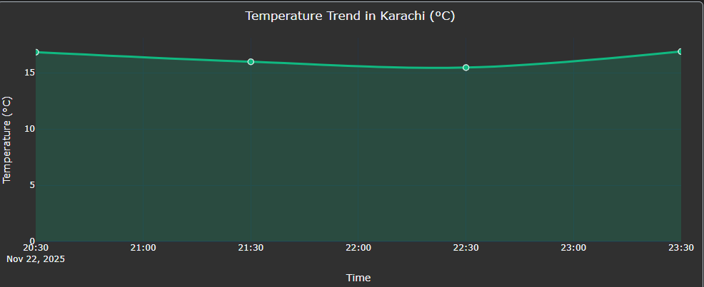

# 🛰️ Advanced Weather ETL Dashboard

## Project Summary

This project is a **professional web dashboard** that monitors real-time weather using a full **Extract, Transform, Load (ETL)** data pipeline. 

[]


It collects current weather data from the **OpenWeatherMap API**, cleans it using **Pandas**, and displays all key metrics (Temperature, Wind, Humidity, Pressure, Visibility, etc.) in a modern, dynamic interface built with **Dash and Plotly**.

---

## 🎯 Key Features

| Component | Description |
| :--- | :--- |
| **ETL Pipeline** | Fully working system to fetch, clean, and analyze data dynamically. |
| **Local Caching** | Saves API responses locally for **10 minutes** to make the dashboard fast and conserve API usage. |
| **Modular Code** | Clean, professional directory structure (`api_client/`, `etl/`, `dashboard/`). |
| **Visualization** | Visually appealing charts (Line Charts, Gauge Meters, and Data Tables) in a modern dark theme. |
| **Error Handling** | Safely handles errors for invalid cities or API connection failures. |

---

## 🚀 Getting Started

Follow these steps to set up and run the dashboard locally.

### 1. Prerequisites

* **Python 3.8+**
* **OpenWeatherMap API Key** (Required for fetching live data)

### 2. Setup (Create Environment)

1.  Go to the `ETL_Project` folder in your terminal.
2.  Create and activate the virtual environment:
    ```bash
    # Create environment folder
    python -m venv venv 

    # Activate (Windows PowerShell)
    .\venv\Scripts\Activate.ps1
    ```
### 3. Install Libraries

Install all necessary libraries (Dash, Pandas, Plotly, etc.):

```bash
pip install -r requirements.txt
pip install dash-bootstrap-components numpy
````

### 4\. Configure API Key

Create a file named **`.env`** in the root directory and add your API key:

```
# .env file content
OPENWEATHERMAP_API_KEY=YOUR_API_KEY_HERE
```

-----

## ▶️ Running the Application

After installation, run the application using `main.py`:

```bash
python main.py
```

### Access the Dashboard

Open your web browser and navigate to:

{http://127.0.0.1:8050/}

Enter a city name and click **"FETCH & ANALYZE"** to see real-time data and charts.

-----

## 🏗️ Project Architecture

```
ETL_Project/
├── analysis/         # Visualization logic (Plotly charts)
├── api_client/       # Extraction and Caching logic
├── cache/            # Local data storage for caching
├── dashboard/        # Dash app UI and callback logic
├── etl/              # Transformation logic (Pandas)
├── .env              # Environment Variables (API Key)
├── main.py           # Application Runner
└── requirements.txt  # Dependencies List
```

```
```